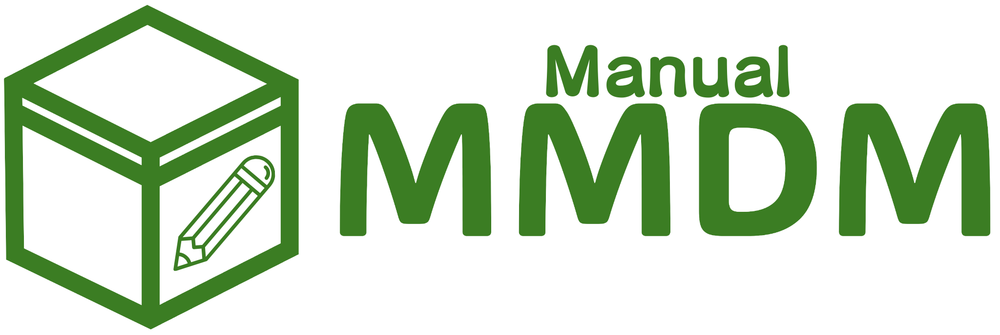

<div align="center">

# Manual-MMDM
A desktop application for managing Minecraft mods and their dependencies with a user-friendly interface.



</div>


## Features

- Manage Minecraft mods with an intuitive GUI
- Track mod dependencies and prevent deletion of mods that others depend on
- Organize mods by categories
- Track mod requirements (client/server-side)
- Mark translated mods
- Search and filter mods
- Expandable/collapsible dependency view
- Automatic file management

## Installation

### Pre-built Binaries

Visit the [Releases](https://github.com/coke5151/manual-mmdm/releases) page to download.

Simply download the appropriate ZIP file for your platform, extract it, and run the executable.

### Building from Source

If you prefer to build from source, follow these steps:

#### Requirements

- Python 3.13+
- PyQt6
- SQLAlchemy
- PDM (Python package manager)

#### Steps

1. Clone the repository:
```bash
git clone https://github.com/coke5151/manual-mmdm.git
cd manual-mmdm
```

2. Install dependencies using PDM:
```bash
pdm install
```

3. Run the application:
```bash
pdm run main
```

## Usage

### Basic Operations

- **Add Mod**: Click "Add Module" button or use File menu
- **Edit Mod**: Double-click a mod or use the Edit button
- **Delete Mod**: Select a mod and click Delete button
- **Manage Categories**: Use the Manage Categories button
- **Search**: Use the search bar to filter mods
- **View Dependencies**: Toggle the "Expand Dependencies" button

## Project Structure

- `src/main.py`: Main application and GUI implementation
- `src/models.py`: Database models and relationships
- `src/database.py`: Database configuration

## License

See the [LICENSE](LICENSE) file for details.
